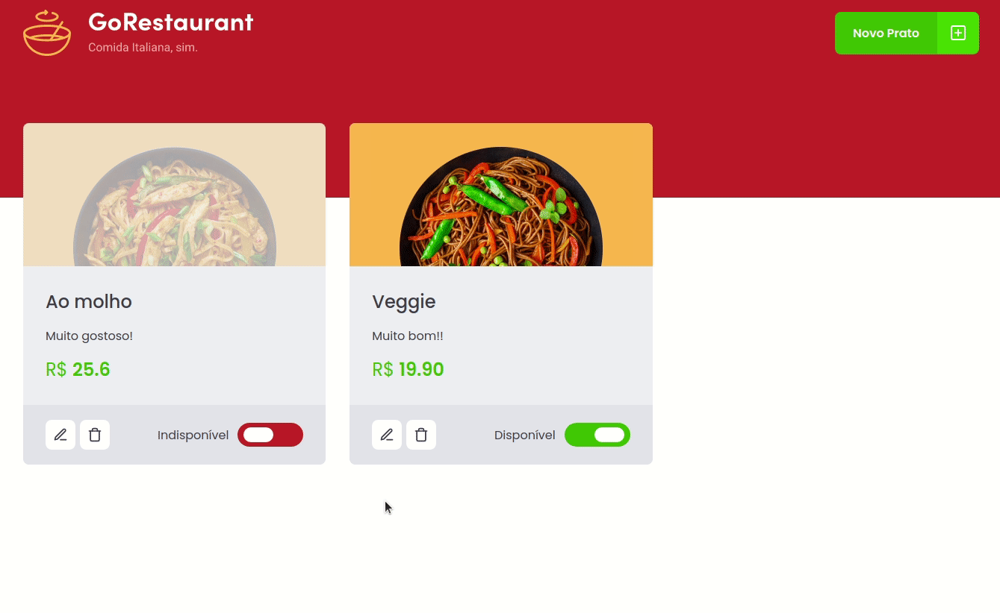
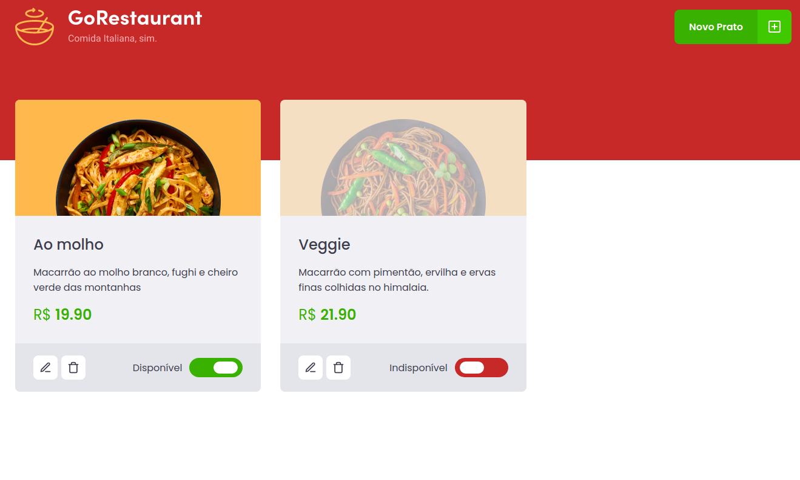
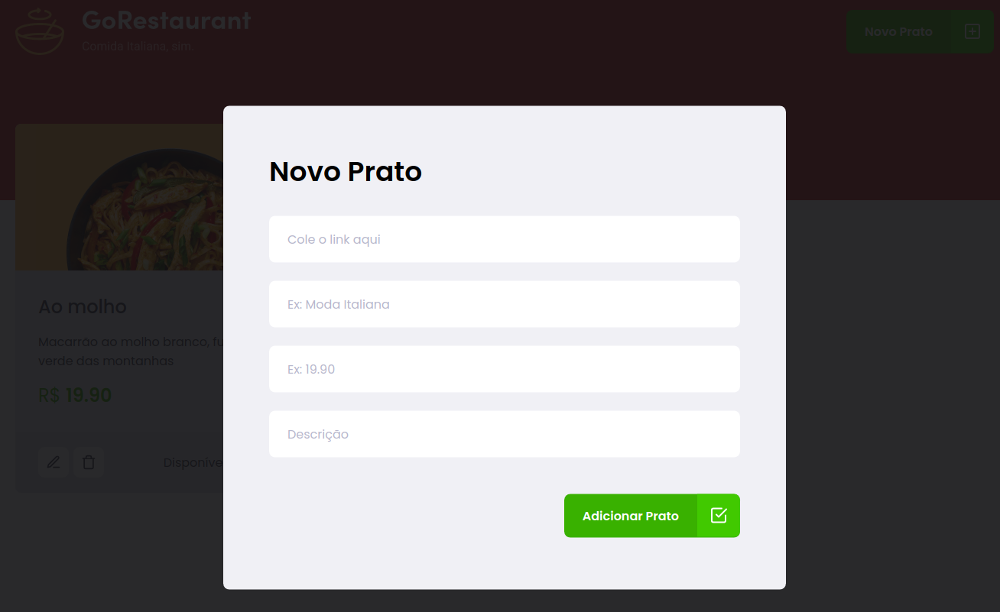
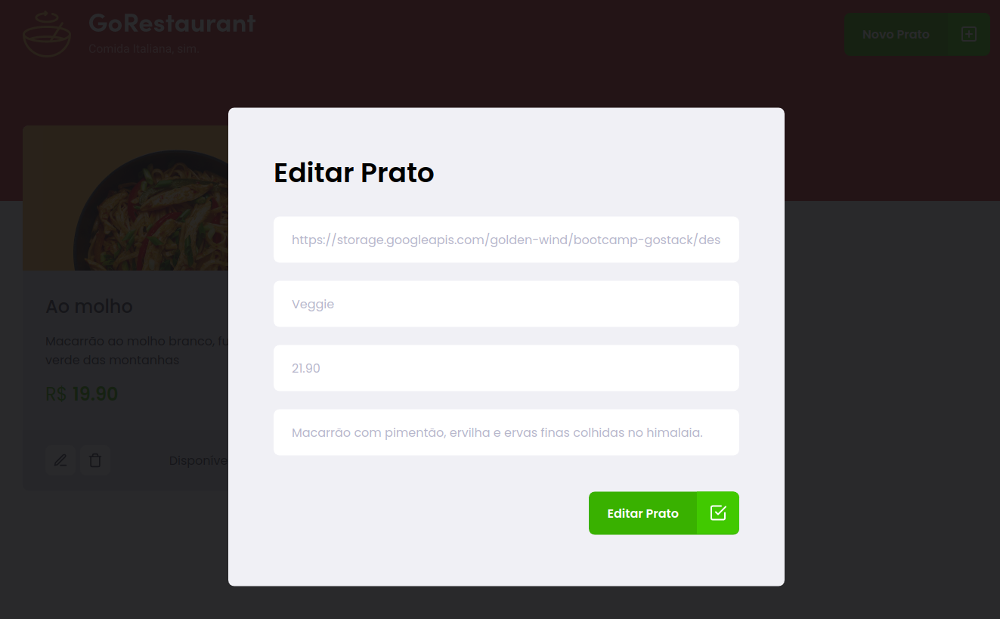

<h1 align="center">GoRestaurant Challenge</h1>
 

# :pushpin: Index
- [Project Media](#camera_flash-project-media)
- [About](#monocle_face-about)
- [Technologies](#rocket-tecnologias-usadas)
- [Author](#closed_book-author)
 

---

# :camera_flash: Project Media

 

---
# :monocle_face: About
This challenge was aimed at refactoring an old React application built in Javascript and Class components in Typescript and Functional components.
 

---

# :rocket: Technologies
This project was developed with the following technologies:  
- :heavy_check_mark: **React**
- :heavy_check_mark: **Styled Components**
- :heavy_check_mark: **Hooks**
- :heavy_check_mark: **Router**
- :heavy_check_mark: **Typescript**
- :heavy_check_mark: **Json Server**
  
 

---

